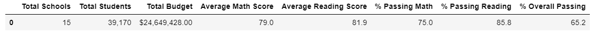
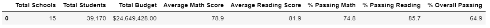
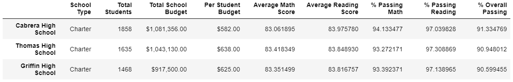
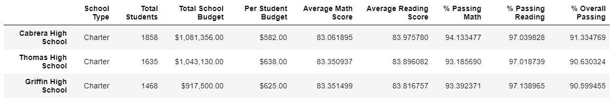
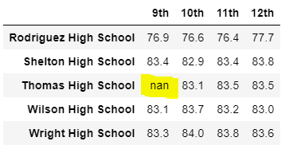
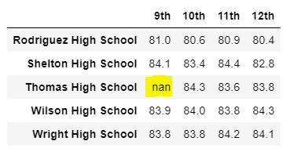
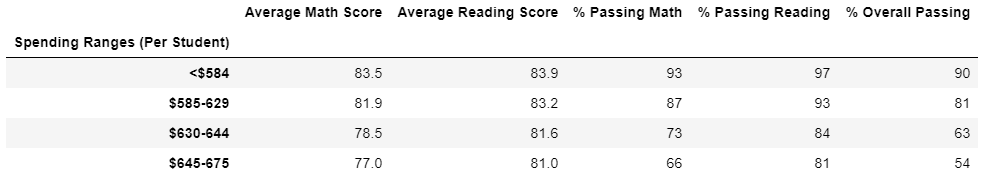
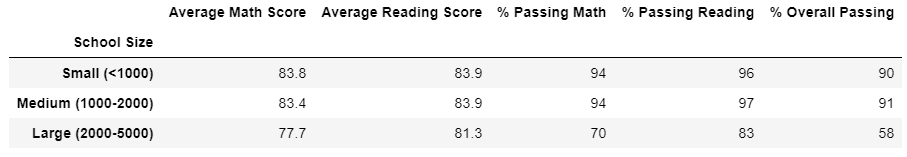
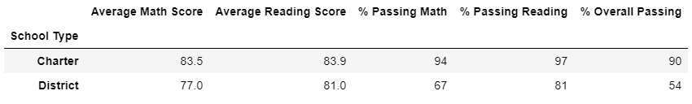

# School District Analysis

## Purpose

The purpose of our analysis is to determine whether removing the 9th grade scores from Thomas High School (replacing with NaNs) has any effect on the overall results of our School District Analysis. 

## Results

When we removed the math and reading scores for all 9th graders at Thomas High School from our data there were several small shifts in our results, summarized below.

* The district summary shows a slight decrease in average math scores (-0.1) while reading scores remained about the same. There were also decreases in passing percentages for math (-0.2%) and reading (-0.1%), as well as for the percentage of students passing both math and reading (-0.3%).

vs.

* The only school that was affected on the school summary data frame was Thomas High School and again the changes were relatively insignificant. The overall passing percentage for the school dropped about 0.3%.

vs.

* The 0.3% drop in overall passing rates did not affect Thomas High School's #2 ranking in comparison to other high schools.

vs.

* The rest of the metrics were not affected at all by removing the 9th grade scores at Thomas High School:
	* Math (left) and reading (right) scores by grade - The only cells that are affected are the 9th grade scores at Thomas High School.
	
         
	* Scores by school spending - No observable change
	
	* Scores by school size - No observable change
	
	* Scores by school type - No observable change
	

## Summary

There were four major changes in the updated school district analysis after the reading and math scores for the ninth grade students at Thomas High School were replaced with NaNs:

1. We had to calculate a new student count total to use for our calculations in the District Analysis
2. We had to calculate new passing percentage rates using the new student count for the District Analysis
3. We had to calculate a new student total for grades 10-12 at Thomas High School
4. We had to calculate new passing percentage rates for grades 10-12 at Thomas High School for the School Analysis Summary.

Once we inserted our calculated values into our School Analysis Summary, we used that modified data frame for the rest of our analysis, which showed that removing the 9th grade scores at Thomas High School had very little effect on our overall results.
